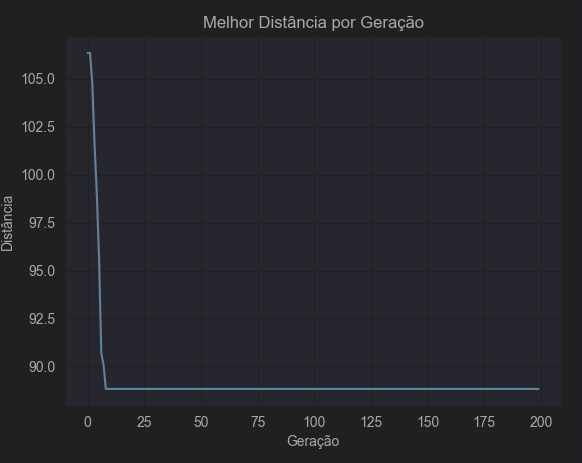
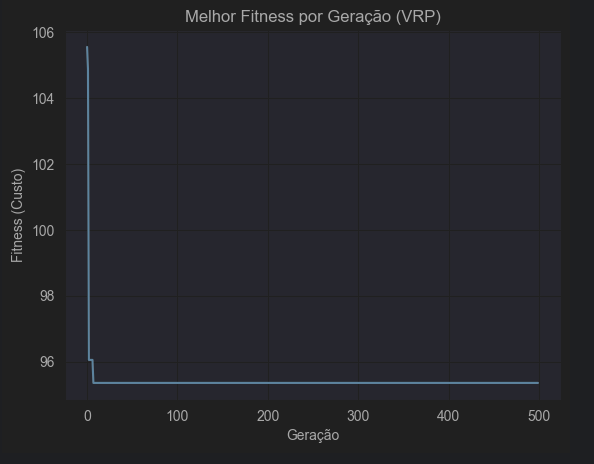
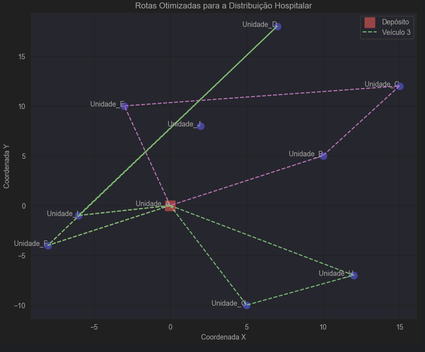

# Projeto de Sistema Inteligente de Suporte ao Diagnóstico Hospitalar

## 1. Visão Geral do Projeto

Este projeto tem como objetivo construir um sistema inteligente de suporte ao diagnóstico, utilizando técnicas de Inteligência Artificial para otimizar processos e auxiliar profissionais de saúde. O projeto foi dividido em duas fases principais:

* **Fase 1: Diagnóstico com Machine Learning** - Foco no desenvolvimento de modelos de classificação para prever doenças com base em dados médicos tabulares.
* **Fase 2: Otimização e Linguagem Natural** - Foco na otimização de rotas para logística hospitalar usando algoritmos genéticos e na geração de relatórios e instruções com LLMs.

## 2. Estrutura do Projeto

A estrutura de diretórios do projeto é organizada da seguinte forma:
````
Saude_IA_Diagnostico/
├── data/                 # Contém os datasets CSV utilizados no projeto (baixados via KaggleHub).
├── notebooks/            # Jupyter Notebooks com as análises completas de ambas as fases.
├── src/                  # Código-fonte principal (classes do AG, LLM, etc.).
├── images/               # Contém imagens para este README.md.
├── .gitignore            # Arquivo de configuração para o controle de versão Git.
├── Dockerfile            # Define o ambiente Docker para execução do projeto.
├── README.md             # Este arquivo, com a documentação geral e o relatório executivo do projeto.
└── requirements.txt      # Lista de todas as bibliotecas Python necessárias.
````
## 3. Metodologia e Resultados por Fase

### 3.1. Fase 1: Diagnóstico com Machine Learning

Nesta fase, foram desenvolvidos modelos de Machine Learning para a classificação de três doenças, utilizando um pipeline de pré-processamento padronizado (tratamento de ausentes, codificação categórica e escalonamento).

* **Doença de Parkinson:**
    * **Desempenho:** Os modelos apresentaram desempenho baixo (Random Forest: Acurácia ~0.55, Recall ~0.51, F1-Score ~0.55, AUC-ROC ~0.60).
    
    
    
    * **Implicação Prática:** **NÃO é adequado para uso clínico**. Modelos com desempenho próximo ao acaso podem gerar muitos erros críticos (Falsos Negativos), comprometendo a segurança do paciente.
    * **Features Importantes:** Características relacionadas a perturbações na voz (`MDVP:Shimmer`, `Jitter:DDP`, `MDVP:Jitter(%)`) foram as mais relevantes.
      
    * **Limitações/Próximos Passos:** O baixo desempenho sugere a necessidade de otimização de hiperparâmetros e a busca por datasets maiores/mais informativos ou modelos mais avançados.

* **Doença Cardíaca:**
    * **Desempenho:** A **Regressão Logística** obteve um desempenho promissor (Acurácia ~0.87, Precisão ~0.81, **Recall ~0.92**, F1-Score ~0.86, AUC-ROC ~0.90), com um número muito baixo de Falsos Negativos.
      
      
      
      
    * **Implicação:** Este modelo demonstra potencial para ser uma ferramenta valiosa de suporte à triagem.
    * **Features Importantes:** Fatores como `ST depression`, `Number of vessels fluro`, `Chest pain type`, `Max HR`, `Cholesterol` e `Age`.
      
    * **Limitações/Próximos Passos:** Validação com mais dados e otimização de hiperparâmetros poderiam aprimorar ainda mais a generalização.

* **Previsão de AVC:**
    * **Desempenho:** Os modelos apresentaram alta acurácia (>0.90), mas um **Recall extremamente baixo para a classe 'Com AVC'** (ex: Regressão Logística e Random Forest com Recall de 0.02) devido ao **extremo desbalanceamento de classes**.
      
      
      
      
    * **Implicação:** **NÃO é adequado para uso clínico**. Modelos com Recall tão baixo falhariam em identificar a maioria dos casos reais de AVC, o que é inaceitável.
    * **Features Importantes:** `avg_glucose_level`, `age`, `bmi`, `hypertension`, `heart_disease`.
      
    * **Desafio Central:** A prioridade é a aplicação de técnicas robustas de balanceamento de classes (como SMOTE) para melhorar o Recall.

### 3.2. Fase 2: Otimização e Linguagem Natural

Nesta fase, foi implementada uma solução para o Problema de Roteamento de Veículos (VRP), que expandiu a lógica do "caixeiro viajante médico" para considerar restrições realistas.

* **Algoritmo Genético:** Foi desenvolvido um algoritmo genético que utiliza uma representação de rota como cromossomo. A função de fitness foi modificada para penalizar rotas que violam a **capacidade de carga e a autonomia dos veículos**.
    

* **Rotas e Restrições:** O algoritmo busca a menor distância total, enquanto tenta acomodar a demanda de cada ponto de entrega em um conjunto de veículos, respeitando as restrições.
    

* **Visualização:** A rota otimizada foi visualizada em um mapa para fácil interpretação.


* **Integração com LLMs:** Foi simulada a integração com uma LLM pré-treinada para gerar:
    * **Instruções detalhadas** para motoristas, transformando a rota otimizada em um texto claro e acionável.
    * **Relatórios diários** sobre a eficiência das rotas, destacando a economia de distância e tempo.

## 4. Conclusão Geral do Projeto

Este projeto demonstra a aplicação de diversas técnicas de IA em problemas do mundo real na área da saúde. Na **Fase 1**, a análise de modelos de Machine Learning mostrou que a performance é altamente dependente da qualidade e natureza dos dados, e que a interpretação crítica é tão importante quanto a acurácia. Na **Fase 2**, a implementação de algoritmos genéticos e a integração com LLMs validam o potencial da IA na otimização de processos logísticos e na geração de valor a partir de dados brutos.

A Inteligência Artificial deve ser encarada como uma **ferramenta de suporte ao diagnóstico**, capaz de otimizar processos, identificar padrões sutis e auxiliar na priorização de casos. **Contudo, a palavra final no diagnóstico e na decisão clínica pertence SEMPRE ao médico.** A expertise humana, o julgamento clínico e a interação com o paciente são insubstituíveis. O sucesso de um sistema de IA em saúde reside na colaboração eficaz entre a tecnologia e os profissionais de saúde.

## 5. Como Configurar e Rodar o Projeto

Você pode configurar e rodar este projeto de forma local (via Conda/PyCharm) ou utilizando Docker. As instruções detalhadas, incluindo como configurar suas credenciais do Kaggle, estão disponíveis abaixo.

### 5.1. Tecnologias e Ferramentas

* **Linguagem de Programação:** Python 3.9+
* **IDE:** PyCharm Community Edition
* **Gerenciamento de Ambiente/Pacotes:** Conda
* **Containerização:** Docker
* **Frameworks/Bibliotecas Python:** `pandas`, `numpy`, `scikit-learn`, `matplotlib`, `seaborn`, `shap`, `jupyter`, `kagglehub`.

### 5.2. Configuração e Execução Local (via Conda/PyCharm)

1.  **Pré-requisitos:**
    * Instale o [Miniconda](https://docs.conda.io/en/latest/miniconda.html) ou [Anaconda](https://www.anaconda.com/download).
    * Instale o [PyCharm Community Edition](https://www.jetbrains.com/pycharm/download/).

2.  **Clone o Repositório Git:**
    ```bash
    git clone [https://github.com/Bielhsn/Diagnosticos_IA.git](https://github.com/Bielhsn/Diagnosticos_IA.git)
    cd Saude_IA_Diagnostico
    ```

3.  **Crie e Ative o Ambiente Virtual (Conda):**
    Abra o terminal (Anaconda Prompt, Terminal) na pasta raiz do projeto (`Saude_IA_Diagnostico`).
    ```bash
    conda create -n saude_ia_env python=3.11 # Use a versão Python que usou, ex: 3.12
    conda activate saude_ia_env
    ```

4.  **Instale as Dependências Python:**
    ```bash
    pip install -r requirements.txt
    ```

5.  **Configure as Credenciais do Kaggle:**
    * Vá para [kaggle.com/account](https://www.kaggle.com/account) (faça login).
    * Na seção "API", clique em "Create New API Token". Um arquivo `kaggle.json` será baixado.
    * Mova `kaggle.json` para `C:\Users\SEU_USUARIO\.kaggle\` (Windows) ou `~/.kaggle/` (macOS/Linux).

6.  **Abra o Projeto no PyCharm:**
    * Selecione "Open" e a pasta `Saude_IA_Diagnostico`.
    * Configure o interpretador Python do projeto para `saude_ia_env`.

7.  **Execute os Notebooks:**
    * Na pasta `notebooks/`, abra cada `.ipynb` e execute as células sequencialmente. Os datasets serão baixados automaticamente para `data/`.

### 5.3. Configuração e Execução via Docker (Recomendado)

1.  **Pré-requisitos:**
    * Instale o [Docker Desktop](https://www.docker.com/products/docker-desktop/). Certifique-se de que esteja em execução.

2.  **Clone o Repositório Git:**
    ```bash
    git clone https://github.com/Bielhsn/Diagnosticos_IA.git
    cd Saude_IA_Diagnostico
    ```

3.  **Configure as Credenciais do Kaggle (para Docker):**
    * Baixe `kaggle.json` de [kaggle.com/account](https://www.kaggle.com/account).
    * Mova-o para `C:\Users\SEU_USUARIO\.kaggle\` (Windows) ou `~/.kaggle/` (macOS/Linux).

4.  **Construa a Imagem Docker:**
    Abra o terminal na pasta raiz do projeto (`Saude_IA_Diagnostico`).
    ```bash
    docker build -t saude_ia_diagnostico .
    ```

5.  **Execute o Contêiner Docker e Acesse o Jupyter:**
    ```bash
    docker run -p 8888:8888 -v C:\Users\SEU_USUARIO\.kaggle\kaggle.json:/root/.kaggle/kaggle.json saude_ia_diagnostico
    ```
    *(**ATENÇÃO:** Substitua `SEU_USUARIO` pelo seu nome de usuário real no Windows).*
    Copie o link (`http://127.0.0.1:8888/tree?token=...`) que aparecer no terminal e cole-o no seu navegador.

6.  **Use os Notebooks:**
    * Na interface do Jupyter, navegue até `notebooks/`, abra os `.ipynb` e execute as células.

## 6. Conclusão Geral do Projeto

Este projeto demonstra a aplicação de diversas técnicas de IA em problemas do mundo real na área da saúde. Na **Fase 1**, a análise de modelos de Machine Learning mostrou que a performance é altamente dependente da qualidade e natureza dos dados, e que a interpretação crítica é tão importante quanto a acurácia. Na **Fase 2**, a implementação de algoritmos genéticos e a integração com LLMs validam o potencial da IA na otimização de processos logísticos e na geração de valor a partir de dados brutos.

A Inteligência Artificial deve ser encarada como uma **ferramenta de suporte ao diagnóstico**, capaz de otimizar processos, identificar padrões sutis e auxiliar na priorização de casos. **Contudo, a palavra final no diagnóstico e na decisão clínica pertence SEMPRE ao médico.** A expertise humana, o julgamento clínico e a interação com o paciente são insubstituíveis. O sucesso de um sistema de IA em saúde reside na colaboração eficaz entre a tecnologia e os profissionais de saúde.

## 7. Tecnologias e Ferramentas

* **Linguagem de Programação:** Python 3.9+
* **IDE:** PyCharm Community Edition
* **Gerenciamento de Ambiente/Pacotes:** Conda
* **Containerização:** Docker
* **Frameworks/Bibliotecas Python:** `pandas`, `numpy`, `scikit-learn`, `matplotlib`, `seaborn`, `shap`, `jupyter`, `kagglehub`.

## 8. Como Configurar e Rodar o Projeto

### 8.1. Configuração e Execução Local (via Conda/PyCharm)

1.  **Pré-requisitos:**
    * Instale o [Miniconda](https://docs.conda.io/en/latest/miniconda.html) ou [Anaconda](https://www.anaconda.com/download).
    * Instale o [PyCharm Community Edition](https://www.jetbrains.com/pycharm/download/).

2.  **Clone o Repositório Git:**
    ```bash
    git clone https://github.com/Bielhsn/Diagnosticos_IA.git
    cd Saude_IA_Diagnostico
    ```

3.  **Crie e Ative o Ambiente Virtual (Conda):**
    Abra o terminal (Anaconda Prompt, Terminal) na pasta raiz do projeto (`Saude_IA_Diagnostico`).
    ```bash
    conda create -n saude_ia_env python=3.11 # Use a versão Python que usou, ex: 3.12
    conda activate saude_ia_env
    ```

4.  **Instale as Dependências Python:**
    ```bash
    pip install -r requirements.txt
    ```

5.  **Configure as Credenciais do Kaggle:**
    * Vá para [kaggle.com/account](https://www.kaggle.com/account) (faça login).
    * Na seção "API", clique em "Create New API Token". Um arquivo `kaggle.json` será baixado.
    * Mova `kaggle.json` para `C:\Users\SEU_USUARIO\.kaggle\` (Windows) ou `~/.kaggle/` (macOS/Linux).

6.  **Abra o Projeto no PyCharm:**
    * Selecione "Open" e a pasta `Saude_IA_Diagnostico`.
    * Configure o interpretador Python do projeto para `saude_ia_env`.

7.  **Execute os Notebooks:**
    * Na pasta `notebooks/`, abra cada `.ipynb` e execute as células sequencialmente. Os datasets serão baixados automaticamente para `data/`.

### 8.2. Configuração e Execução via Docker (Recomendado)

1.  **Pré-requisitos:**
    * Instale o [Docker Desktop](https://www.docker.com/products/docker-desktop/). Certifique-se de que esteja em execução.

2.  **Clone o Repositório Git:**
    ```bash
    git clone https://github.com/Bielhsn/Diagnosticos_IA.git
    cd Saude_IA_Diagnostico
    ```

3.  **Configure as Credenciais do Kaggle (para Docker):**
    * Baixe `kaggle.json` de [kaggle.com/account](https://www.kaggle.com/account).
    * Mova-o para `C:\Users\SEU_USUARIO\.kaggle\` (Windows) ou `~/.kaggle/` (macOS/Linux).

4.  **Construa a Imagem Docker:**
    Abra o terminal na pasta raiz do projeto (`Saude_IA_Diagnostico`).
    ```bash
    docker build -t saude_ia_diagnostico .
    ```

5.  **Execute o Contêiner Docker e Acesse o Jupyter:**
    ```bash
    docker run -p 8888:8888 -v C:\Users\SEU_USUARIO\.kaggle\kaggle.json:/root/.kaggle/kaggle.json saude_ia_diagnostico
    ```
    *(**ATENÇÃO:** Substitua `SEU_USUARIO` pelo seu nome de usuário real no Windows).*
    Copie o link (`http://127.0.0.1:8888/tree?token=...`) que aparecer no terminal e cole-o no seu navegador.

6.  **Use os Notebooks:**
    * Na interface do Jupyter, navegue até `notebooks/`, abra os `.ipynb` e execute as células.

## 9. Contato

Gabriel Henrique Souza - gabrielhenrique.hsn@gmail.com