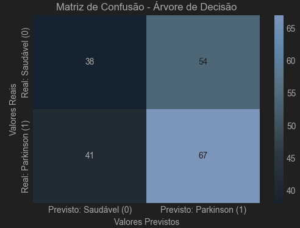
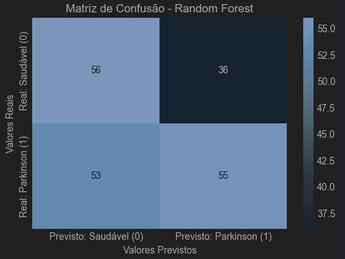

# Projeto de Sistema Inteligente de Suporte ao Diagnóstico Hospitalar

Este projeto tem como objetivo desenvolver modelos de Machine Learning para auxiliar no diagnóstico de diversas doenças, focando inicialmente em Doença de Parkinson, Doença Cardíaca e Acidente Vascular Cerebral (AVC). A solução visa processar dados médicos tabulares, identificar padrões e fornecer um suporte inicial para médicos e equipes clínicas.

## 1. Visão Geral do Projeto

Com o crescente volume de dados de pacientes e exames, hospitais universitários buscam soluções inteligentes para otimizar a triagem e apoiar decisões médicas. Este projeto, em sua fase inicial, foca na aplicação de Machine Learning para a classificação diagnóstica, utilizando dados estruturados de exames e prontuários.

## 2. Estrutura do Projeto

A estrutura de diretórios do projeto é organizada da seguinte forma:
````
Saude_IA_Diagnostico/
├── data/                 # Contém os datasets CSV utilizados no projeto (baixados via KaggleHub).
├── notebooks/            # Jupyter Notebooks com as análises completas para cada doença.
├── src/                  # (Opcional) Scripts Python auxiliares e funções reutilizáveis.
├── reports/              # (Opcional) Armazena resultados importantes, gráficos e o relatório técnico final em PDF.
├── .gitignore            # Arquivo de configuração para o controle de versão Git.
├── Dockerfile            # Define o ambiente Docker para execução do projeto.
├── README.md             # Este arquivo, com a documentação geral do projeto.
└── requirements.txt      # Lista de todas as bibliotecas Python necessárias para o projeto.
````
## 3. Datasets Utilizados

Os seguintes datasets, obtidos do Kaggle, são utilizados neste projeto para a classificação binária (diagnóstico de "tem" ou "não tem" a doença). **Eles são baixados automaticamente via `kagglehub` durante a execução dos notebooks.**

* **Doença de Parkinson:**
    * **ID Kaggle:** `shreyadutta1116/parkinsons-disease`
    * **Nome do arquivo:** `updated_dataset.csv`
    * **Problema:** Prever a presença da doença de Parkinson com base em características de voz.

* **Doença Cardíaca:**
    * **ID Kaggle:** `rishidamarla/heart-disease-prediction`
    * **Nome do arquivo:** `Heart_Disease_Prediction.csv`
    * **Problema:** Prever a presença de doença cardíaca com base em atributos clínicos e resultados de exames.

* **Previsão de AVC:**
    * **ID Kaggle:** `fedesoriano/stroke-prediction-dataset`
    * **Nome do arquivo:** `healthcare-dataset-stroke-data.csv`
    * **Problema:** Prever se um paciente terá um Acidente Vascular Cerebral (AVC) com base em diversos fatores de risco.

## 4. Tecnologias e Ferramentas

* **Linguagem de Programação:** Python 3.9+ (recomendado Python 3.11/3.12)
* **IDE:** PyCharm Community Edition
* **Gerenciamento de Ambiente/Pacotes:** Conda (usado no ambiente local)
* **Containerização:** Docker
* **Frameworks/Bibliotecas Python:** `pandas`, `numpy`, `scikit-learn`, `matplotlib`, `seaborn`, `shap`, `jupyter`, `kagglehub` (listadas no `requirements.txt`).

## 5. Como Configurar e Rodar o Projeto

Você pode configurar e rodar este projeto de duas maneiras: **Localmente (via Conda/PyCharm)** ou usando **Docker (recomendado para facilidade de uso e reprodutibilidade)**.

### 5.1. Configuração e Execução Local (via Conda/PyCharm)

1.  **Pré-requisitos:**
    * Instale o [Miniconda](https://docs.conda.io/en/latest/miniconda.html) ou [Anaconda](https://www.anaconda.com/download) para gerenciar ambientes Python.
    * Instale o [PyCharm Community Edition](https://www.jetbrains.com/pycharm/download/).

2.  **Clone o Repositório Git (se ainda não o fez):**
    ```bash
    git clone Diagnostico_Doencas
    cd Saude_IA_Diagnostico
    ```

3.  **Crie e Ative o Ambiente Virtual (usando Conda):**
    Abra o terminal (Anaconda Prompt no Windows, Terminal no macOS/Linux) na pasta raiz do projeto (`Saude_IA_Diagnostico`).
    ```bash
    conda create -n saude_ia_env python=3.11
    conda activate saude_ia_env
    ```

## 4. Metodologia Geral

A abordagem para cada dataset seguiu um pipeline padronizado de Machine Learning:

1.  **Análise Exploratória de Dados (EDA):** Carregamento, inspeção de características (tamanho, tipos de dados), análise estatística descritiva, verificação de valores ausentes e contagem de valores únicos. Visualização da distribuição da variável alvo para identificar desbalanceamentos.
2.  **Pré-processamento de Dados:**
    * **Separação:** Variáveis preditoras (X) e variável alvo (y).
    * **Tratamento de Ausentes:** Imputação (média) para colunas com dados faltantes (ex: 'bmi' no dataset de AVC).
    * **Tratamento de Categóricas:** Codificação One-Hot (`OneHotEncoder`) para variáveis nominais (ex: 'gender', 'Chest pain type').
    * **Escalonamento:** Padronização (`StandardScaler`) de variáveis numéricas para normalizar a escala.
    * Todas as transformações foram orquestradas em um `ColumnTransformer` dentro de um `Pipeline`.
3.  **Modelagem:**
    * **Divisão:** Dados separados em conjuntos de treino (80%) e teste (20%) usando `train_test_split` com estratificação (`stratify=y`) para manter a proporção das classes alvo.
    * **Modelos:** Foram treinados três modelos de classificação: Regressão Logística, Árvore de Decisão e Random Forest.
4.  **Avaliação:**
    * Métricas: Acurácia, Precisão, Recall, F1-Score e AUC-ROC foram calculadas no conjunto de teste.
    * Matriz de Confusão: Visualização dos Verdadeiros Positivos/Negativos e Falsos Positivos/Negativos.
    * Discussão da Escolha de Métricas: Enfatizada a importância de Recall, F1-Score e AUC-ROC para problemas de diagnóstico (minimizando Falsos Negativos).
5.  **Interpretação:**
    * **Feature Importance:** Analisada para o modelo Random Forest, identificando as características mais relevantes para a previsão.
    * SHAP: Tentativa de implementação (código incluído nos notebooks), porém com problemas de compatibilidade/execução. A análise focou na Feature Importance.

## 5. Resultados Obtidos e Relatório Técnico Detalhado

Os resultados detalhados, incluindo todos os prints, gráficos, e a análise aprofundada de cada etapa (EDA, pré-processamento, avaliação de modelos, matrizes de confusão e interpretação de features), estão disponíveis nos respectivos **Jupyter Notebooks** localizados na pasta `notebooks/`. Cada notebook serve como um relatório técnico completo para o dataset específico.

A seguir, um resumo executivo dos principais achados e discussões críticas para cada doença:

### 5.1. Diagnóstico da Doença de Parkinson

* **Desempenho:** Os modelos demonstraram desempenho baixo (Random Forest: Acurácia ~0.55, Recall ~0.51, F1-Score ~0.55, AUC-ROC ~0.60).
  
  
  
  
* **Implicação Prática:** **NÃO é adequado para uso clínico**. Modelos com desempenho próximo ao acaso podem gerar muitos erros críticos (Falsos Negativos), comprometendo a segurança do paciente.
* **Features Importantes:** Características relacionadas a perturbações na voz (`MDVP:Shimmer`, `Jitter:DDP`, `MDVP:Jitter(%)`) foram as mais relevantes, alinhando-se com o conhecimento médico sobre os sintomas da doença.
  
* **Limitações/Próximos Passos:** O baixo desempenho sugere a necessidade de otimização de hiperparâmetros, engenharia de features mais complexa, técnicas de balanceamento de classes (se necessário), ou até mesmo a busca por datasets maiores/mais informativos ou modelos mais avançados.

### 5.2. Diagnóstico de Doença Cardíaca

* **Desempenho:** Os modelos demonstraram desempenho promissor, com a **Regressão Logística** se destacando (Acurácia ~0.87, Precisão ~0.81, **Recall ~0.92**, F1-Score ~0.86, AUC-ROC ~0.90). O Recall alto é crucial para este contexto.
  
  
  
* **Implicação Prática:** Apresenta potencial para ser uma **ferramenta valiosa de suporte à triagem**, ajudando a identificar pacientes com alto risco e minimizando significativamente os Falsos Negativos (apenas 2 FNs para Regressão Logística).
* **Features Importantes:** Fatores como `ST depression`, `Number of vessels fluro`, `Chest pain type`, `Max HR`, `Cholesterol` e `Age` foram considerados mais influentes, corroborando os conhecimentos médicos sobre fatores de risco cardiovascular.
  
* **Limitações/Próximos Passos:** O dataset é menor (270 entradas). Validação com mais dados e otimização de hiperparâmetros poderiam aprimorar ainda mais a generalização.

### 5.3. Previsão de Acidente Vascular Cerebral (AVC)

* **Desempenho:** Os modelos apresentaram alta acurácia (acima de 0.90), mas um **Recall extremamente baixo para a classe 'Com AVC'** (ex: Regressão Logística e Random Forest com Recall de 0.02, identificando apenas 1 em 50 casos reais de AVC). Isso é devido ao **extremo desbalanceamento de classes** (apenas ~4.9% de casos de AVC).
  
  
  
  
* **Implicação Prática:** **NÃO é adequado para uso clínico**. A alta acurácia é enganosa. Modelos com Recall tão baixo falhariam em identificar a vasta maioria dos casos reais de AVC, o que é inaceitável para uma condição tão grave.
* **Features Importantes:** As features mais importantes (`avg_glucose_level`, `age`, `bmi`, `hypertension`, `heart_disease`) estão alinhadas com os fatores de risco conhecidos para AVC.
  
* **Limitações/Próximos Passos:** A prioridade absoluta é a aplicação de **técnicas robustas de balanceamento de classes** (como SMOTE) durante o treinamento do modelo para melhorar o Recall da classe minoritária. Otimização de hiperparâmetros e a exploração de modelos específicos para dados desbalanceados também seriam cruciais.

## 6. Conclusão Geral e Implicações Práticas da IA em Saúde

Este projeto demonstrou a aplicação de fundamentos essenciais de Machine Learning no contexto do diagnóstico médico. Observamos que o desempenho varia significativamente entre os datasets, destacando a importância da qualidade e da natureza dos dados. Enquanto o modelo de Doença Cardíaca mostrou-se promissor como ferramenta de triagem, os modelos para Parkinson e AVC, em sua configuração atual, reforçam que a IA não é uma solução "mágica" e exige atenção a desafios como o desbalanceamento de classes e a representatividade dos dados.

A Inteligência Artificial deve ser encarada como uma **ferramenta de suporte ao diagnóstico**, capaz de otimizar processos, identificar padrões sutis e auxiliar na priorização de casos. **Contudo, a palavra final no diagnóstico e na decisão clínica pertence SEMPRE ao médico.** A expertise humana, o julgamento clínico e a interação com o paciente são insubstituíveis. O sucesso de um sistema de IA em saúde reside na colaboração eficaz entre a tecnologia e os profissionais de saúde.

## 7. Tecnologias e Ferramentas

* **Linguagem de Programação:** Python 3.9+
* **IDE:** PyCharm Community Edition
* **Gerenciamento de Ambiente/Pacotes:** Conda
* **Containerização:** Docker
* **Frameworks/Bibliotecas Python:** `pandas`, `numpy`, `scikit-learn`, `matplotlib`, `seaborn`, `shap`, `jupyter`, `kagglehub`.

## 8. Como Configurar e Rodar o Projeto

### 8.1. Configuração e Execução Local (via Conda/PyCharm)

1.  **Pré-requisitos:**
    * Instale o [Miniconda](https://docs.conda.io/en/latest/miniconda.html) ou [Anaconda](https://www.anaconda.com/download).
    * Instale o [PyCharm Community Edition](https://www.jetbrains.com/pycharm/download/).

2.  **Clone o Repositório Git:**
    ```bash
    git clone https://github.com/Bielhsn/Diagnosticos_IA.git
    cd Saude_IA_Diagnostico
    ```

3.  **Crie e Ative o Ambiente Virtual (Conda):**
    Abra o terminal (Anaconda Prompt, Terminal) na pasta raiz do projeto (`Saude_IA_Diagnostico`).
    ```bash
    conda create -n saude_ia_env python=3.11 # Use a versão Python que usou, ex: 3.12
    conda activate saude_ia_env
    ```

4.  **Instale as Dependências Python:**
    ```bash
    pip install -r requirements.txt
    ```

5.  **Configure as Credenciais do Kaggle:**
    * Vá para [kaggle.com/account](https://www.kaggle.com/account) (faça login).
    * Na seção "API", clique em "Create New API Token". Um arquivo `kaggle.json` será baixado.
    * Mova `kaggle.json` para `C:\Users\SEU_USUARIO\.kaggle\` (Windows) ou `~/.kaggle/` (macOS/Linux).

6.  **Abra o Projeto no PyCharm:**
    * Selecione "Open" e a pasta `Saude_IA_Diagnostico`.
    * Configure o interpretador Python do projeto para `saude_ia_env`.

7.  **Execute os Notebooks:**
    * Na pasta `notebooks/`, abra cada `.ipynb` e execute as células sequencialmente. Os datasets serão baixados automaticamente para `data/`.

### 8.2. Configuração e Execução via Docker (Recomendado)

1.  **Pré-requisitos:**
    * Instale o [Docker Desktop](https://www.docker.com/products/docker-desktop/). Certifique-se de que esteja em execução.

2.  **Clone o Repositório Git:**
    ```bash
    git clone https://github.com/Bielhsn/Diagnosticos_IA.git
    cd Saude_IA_Diagnostico
    ```

3.  **Configure as Credenciais do Kaggle (para Docker):**
    * Baixe `kaggle.json` de [kaggle.com/account](https://www.kaggle.com/account).
    * Mova-o para `C:\Users\SEU_USUARIO\.kaggle\` (Windows) ou `~/.kaggle/` (macOS/Linux).

4.  **Construa a Imagem Docker:**
    Abra o terminal na pasta raiz do projeto (`Saude_IA_Diagnostico`).
    ```bash
    docker build -t saude_ia_diagnostico .
    ```

5.  **Execute o Contêiner Docker e Acesse o Jupyter:**
    ```bash
    docker run -p 8888:8888 -v C:\Users\SEU_USUARIO\.kaggle\kaggle.json:/root/.kaggle/kaggle.json saude_ia_diagnostico
    ```
    *(**ATENÇÃO:** Substitua `SEU_USUARIO` pelo seu nome de usuário real no Windows).*
    Copie o link (`http://127.0.0.1:8888/tree?token=...`) que aparecer no terminal e cole-o no seu navegador.

6.  **Use os Notebooks:**
    * Na interface do Jupyter, navegue até `notebooks/`, abra os `.ipynb` e execute as células.

## 9. Contato

[](https://www.linkedin.com/in/gabriel-henrique-2631931b2/)
[](mailto:gabrielhenrique.hsn@gmail.com)
